# 国赛2019决赛Web1 - 滑稽云音乐

## 题目信息：

* 题目名称：cloudmusic
* 题目类型：Web + Pwn
* 预估难度：困难

## 题目描述：

```
滑稽云音乐平台正式上线，成为全球最大最安全的在线音乐分享网站。
```

## 题目考点：

```
1. php://filter 任意文件读取
2. FFI 调用库大小设计不当，溢出泄漏管理员密码
3. FFI 调用库里的 __attribute__ ((constructor)) 构造函数
4. suid 程序读取 flag 文件
```

## 思路简述：

先审计源代码，找到首页备注里有 `#firmware` 功能，然后注册登录，在我的分享页面里找到 `/media/share.php` ，可以用这个文件结合 `php://filter` 任意文件读取，然后审计网站目录下的各种文件。找到 `/lib/parser.so` 文件，反编译得知上传一个构造好的音乐文件可以溢出泄漏管理员密码。拿到管理员密码，登录访问 `#firmware` ，可以上传构造好的 `.so` 文件，然后猜解上传文件名进行固件版本查询，即可 `getshell` 。 `getshell` 后没有权限读取 `flag` 文件，可以找到 `/usr/bin/tac` 文件具有 `suid` 权限，成功读取到 `flag` 。

## 题目提示：

1. parser.so(frame_size) 溢出
2. __attribute__ ((constructor))
3. suid

## 原始 flag 及更新命令：

```
# 原始 flag
flag{flag_test}

# 更新 flag 命令
echo 'flag{85c2a01a-55f7-442a-8712-3f6908e1463a}' > /flag
或
docker exec -i -t xxxxxxxxxx bash -c "echo flag{85c2a01a-55f7-442a-8712-3f6908e1463a} > /flag"
```

## 题目环境：

```
1. Debian 10 (buster)
2. Apache/2.4.38 (Debian)
3. PHP/7.4.0alpha2 with FFI
```

## 题目制作过程：

1. 设计好漏洞，编写php和c相关代码，编译.so库文件
2. 按照“Docker示例文档v1.4.md”来编写Dockerfile，制作好镜像。

## 题目writeup：

先审计源代码，找到首页备注里有 `#firmware` 功能。

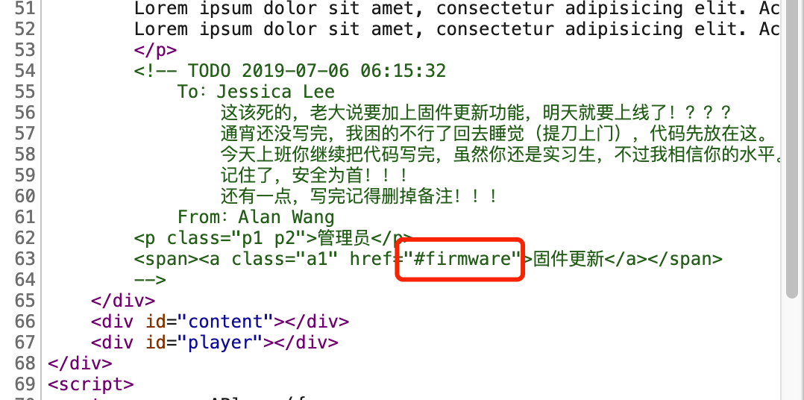

`#firmware` 功能需要登录，而且只有管理员有权限访问。

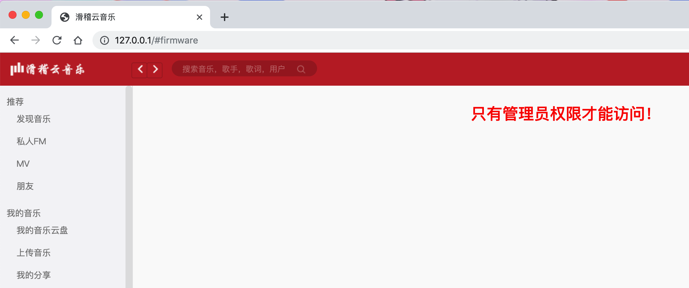

然后注册登录，在我的分享页面里看到一首英文歌，其它都是中文歌，而且这首英文歌在首页就已经放入到播放器列表里。所以看分享 `#share` 页面源代码，能看到 `/media/share.php?` 后面还用 `btoa` 也就是 `base64编码`，所以这里不难发现有个任意文件读取，结合 `php://filter/` 即可利用。

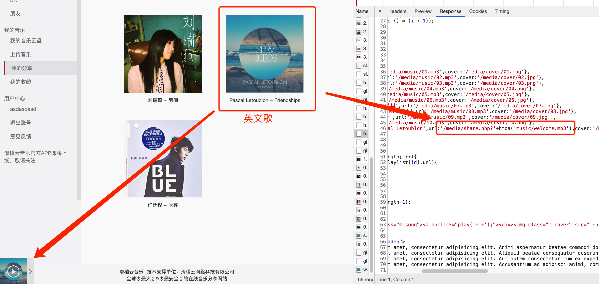

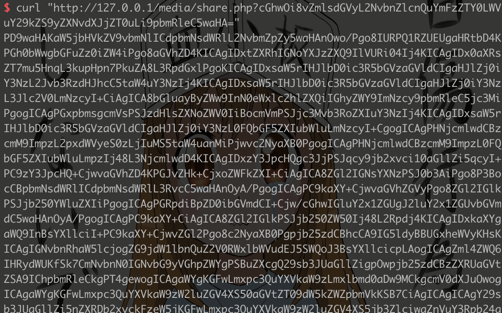

然后就是读取网站目录下的文件，进行源代码审计。我们的目标就是拿到管理员密码，然后访问 `#firmware` 功能。

那么我们需要找到源代码里，哪里读取到管理员密码，这些位置并不多。这里漏洞点在 `/include/upload.php` 的第47和48行处，调用到 `/lib/parser.so` 进行音频文件解析。

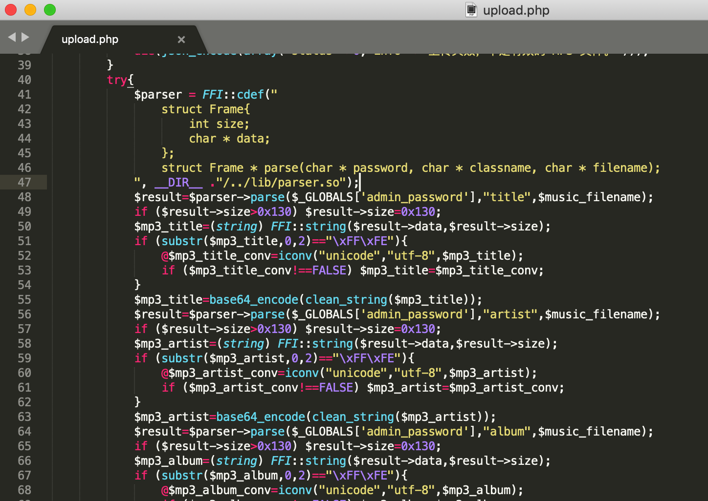

那么我们需要用 `IDA` 反编译 `/lib/parser.so` 文件，漏洞点在 `read_title` / `read_artist` / `read_album` 三个函数里的 `frame_size` 和 `memcpy` 处。

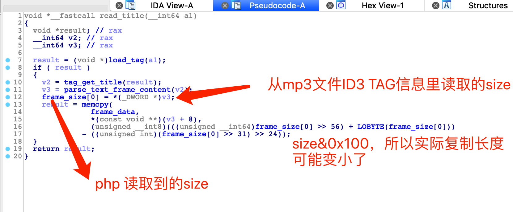

我们可以构造一个 `mp3` 文件，使得 `size` 很大的。

```
bss段上：
0x92C0 _frame_data (length:0x100)
0x93C0 _passwd

_frame_data位于_passwd的上方
```


`size` 限制了 `0x130`，能够溢出读取 `0x30` 字节，足够读取到后面的管理员密码。

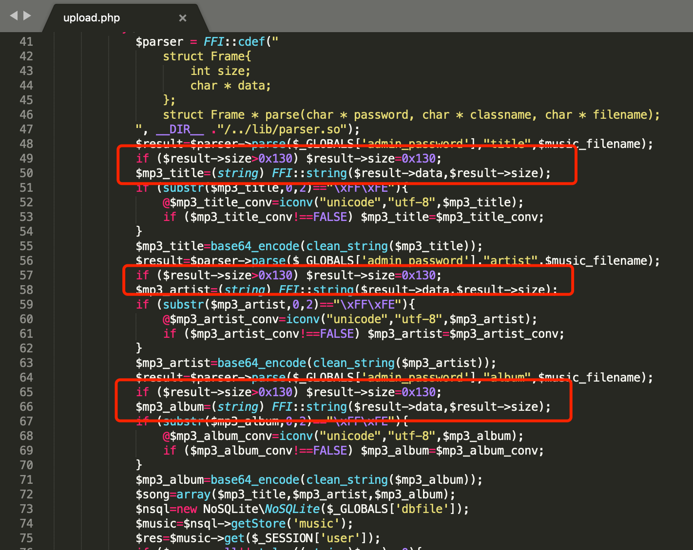

然后有个 `unicode` 转码，可以用导致转码失败的非编码表符号进行填充，而且不能以 `unicode` 的 `FFFE` 开头，必须填充字符足够达到我们伪造的 `size` 的长度，防止 `parser.so` 在解析时出错。


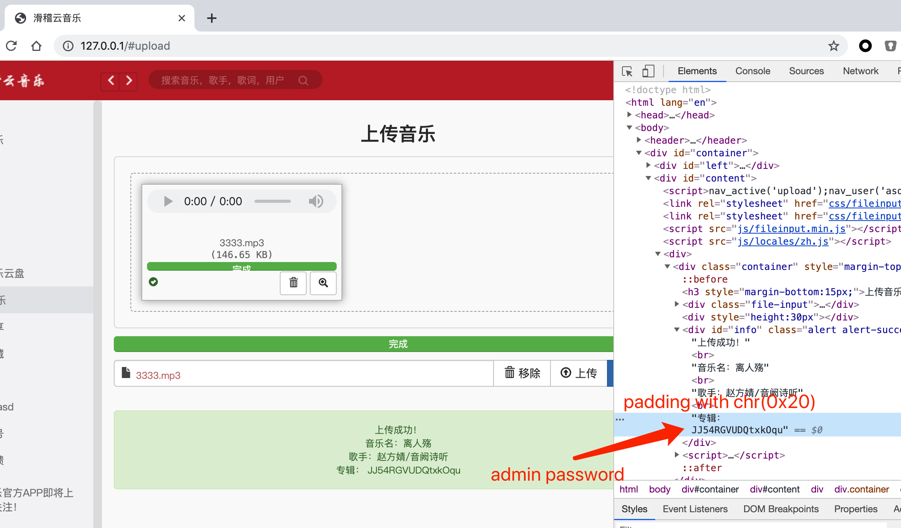

拿到管理员 `admin` 的密码 `JJ54RGVUDQtxkOqu`，登录后有权限访问 `#firmware`。

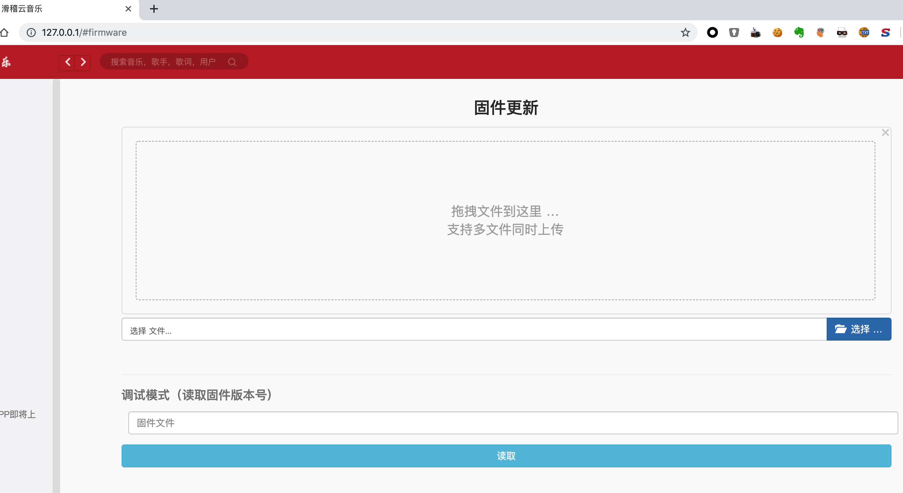

审计 `/include/firmware.php` 下的代码，可以看到上传后的文件使用 `mt_srand` / `time` / `mt_rand` 三个函数进行处理。

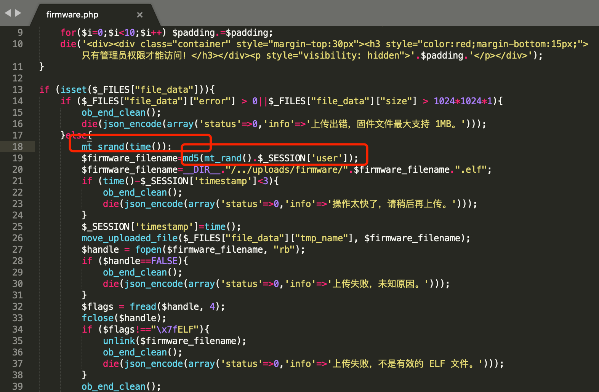

关于 `php` 版本和服务器时间，可以在响应头里看到。然后 `php7` 的 `mt_rand` 修复了以前 `php5` 生成随机数的错误，所以生成的随机数与 `php5` 不一样，这一点需要注意。

关于这个时间的猜解有很多方法，可以用服务器时间，也可以用本机时间，然后带上时区的跨度去爆破。

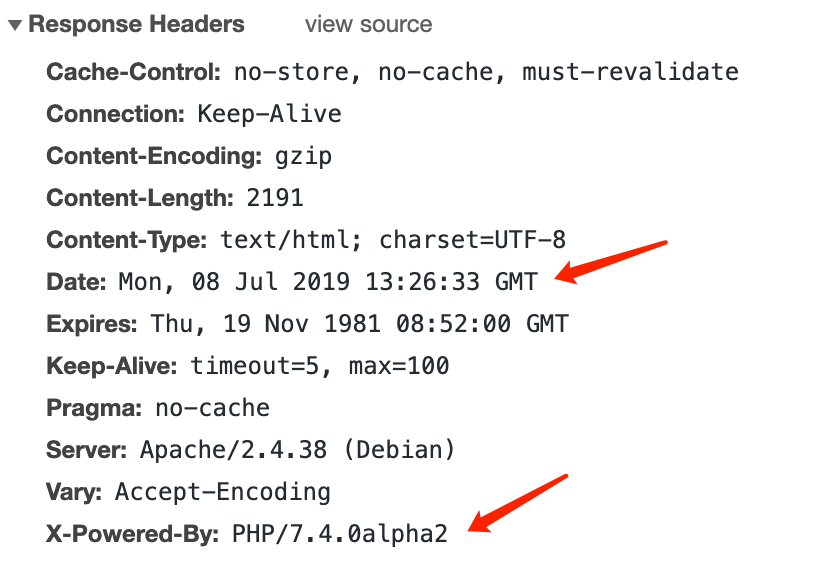

然后漏洞点在这里，会加载我们上传的固件文件，然后读取里面的 `version` 变量，但是没有执行任意函数。

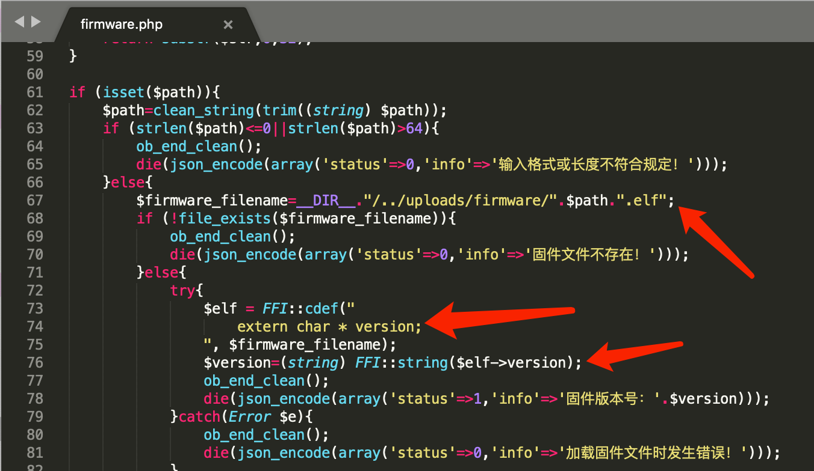

但其实，加载过程就是一个初始化的过程，`.so` 库会从 `_init` 开始执行，然后 `_fini` 结束。

这里我们使用 `__attribute__ ((constructor))` 具有执行优先级的构造函数，在 `_init` 之后执行。

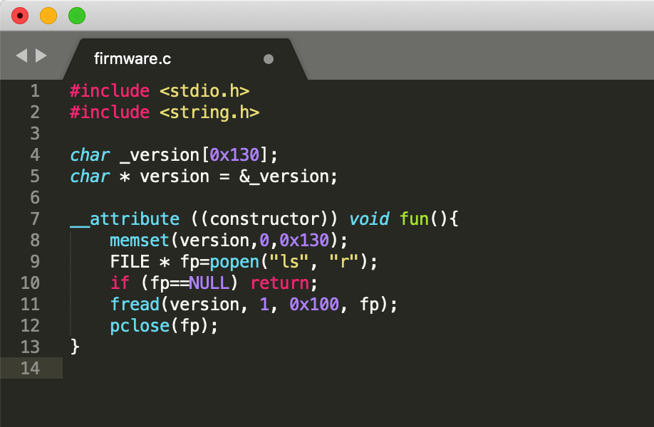

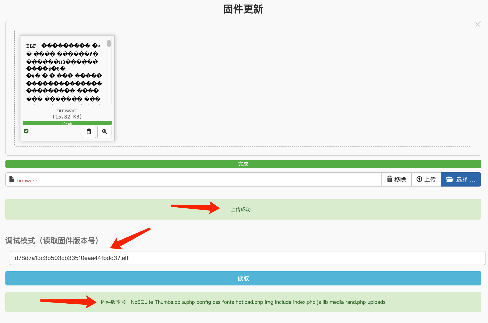

这样就能成功 `getshell`，但是我们是 `www-data` 用户，对 `/flag` 文件没有读取权限。

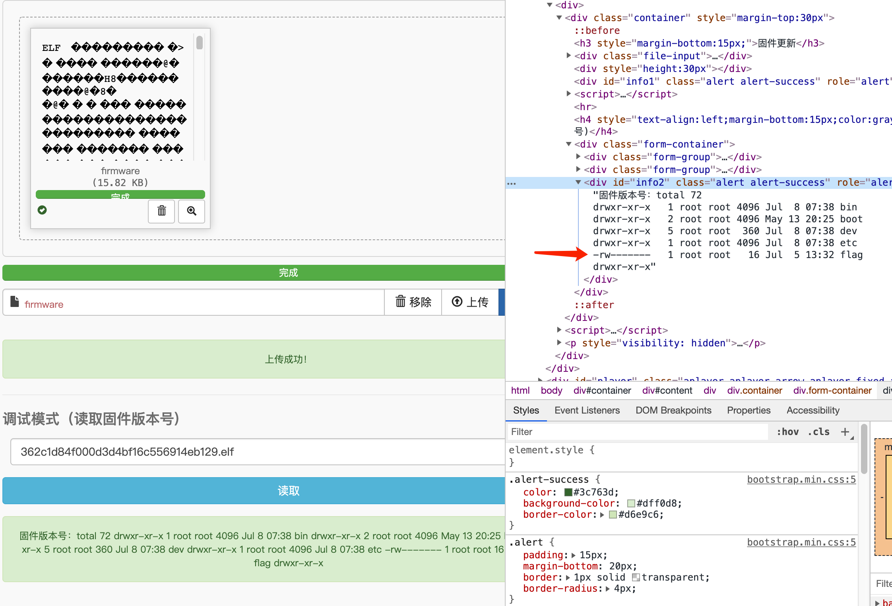

我们需要找到一个具有 `suid` 权限的程序去读取，`/usr/bin/tac` 具有 `suid` 权限，能够读取到 `/flag` 文件的内容。

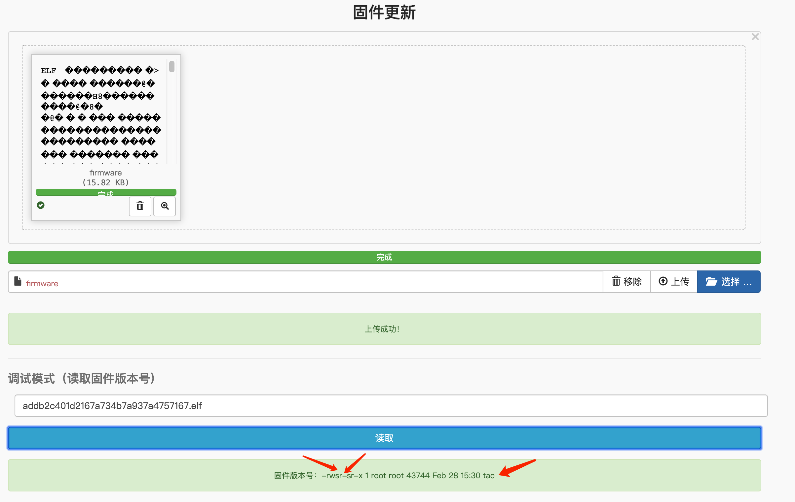

那么可以构造payload：`/usr/bin/tac /flag`，进行读取。

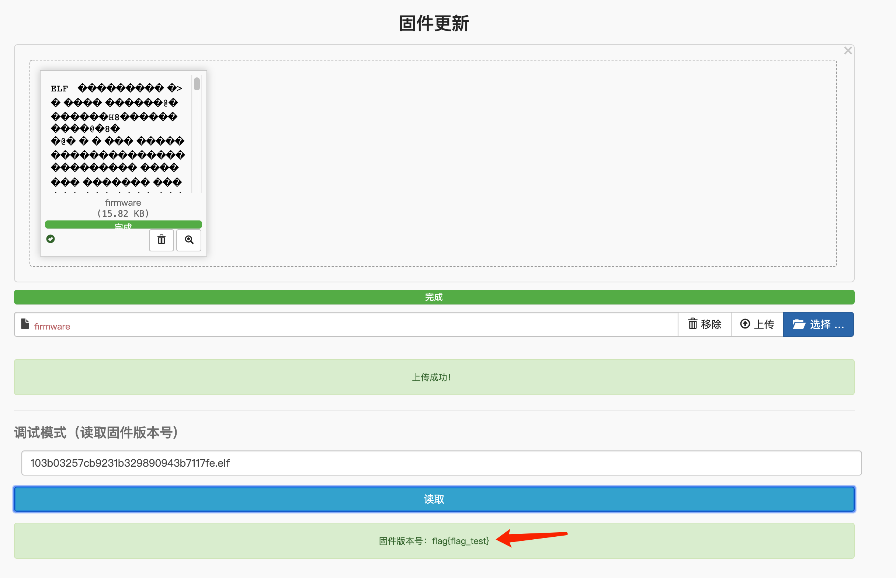

Flag：`flag{flag_test}`

## 注意事项

1. 题目名称不要有特殊符号，可用下划线代替空格；
2. 根据设计的赛题，自行完善所有文件夹中的信息；
3. 此文件夹下信息未完善的队伍，将扣除一定得分。